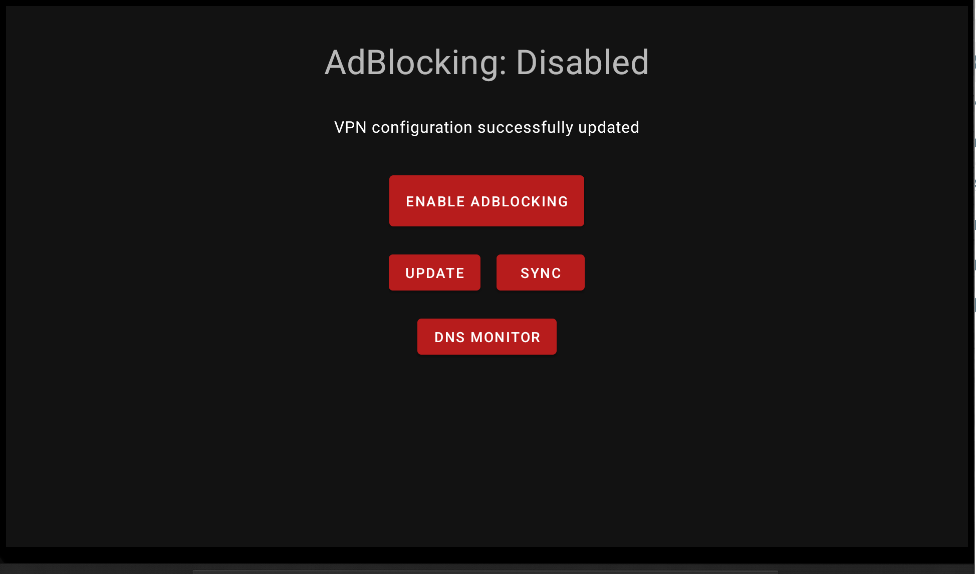
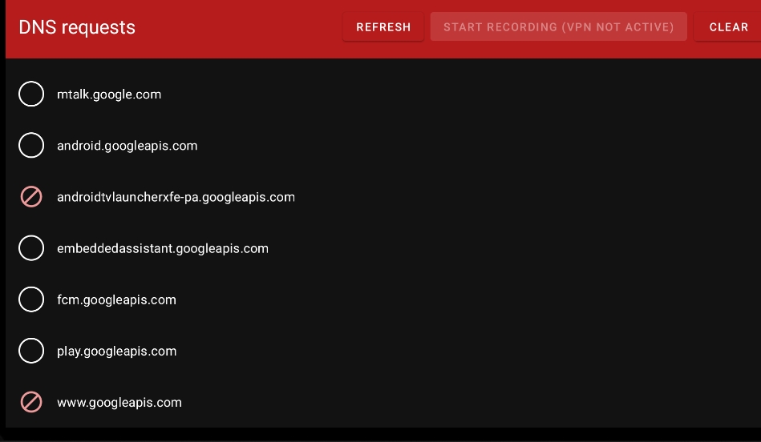
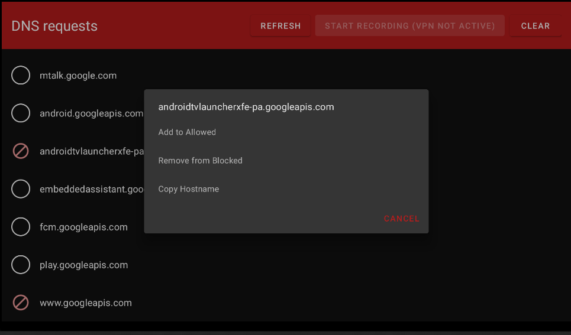

#  AdAway

AdAway is an open source ad blocker for Android using the hosts file and local VPN.
Now with **Android TV support** — block ads across your phone, tablet, and TV from a single app.

## Screenshots

### Android TV

### Phone

For more information visit https://adaway.org

> For the original project README, see [README_OLD.md](README_OLD.md).

## Features

- **Two ad-blocking methods:**
  - **Root mode** — modifies the system `/etc/hosts` file (requires root access)
  - **VPN mode** — uses a local VPN to intercept DNS queries (no root required)
- **Multiple hosts sources** with support for GitHub, GitLab, and Gist providers
- **Three list types:** Blocked, Allowed (whitelist), and Redirected hosts
- **DNS request logging** to monitor and manage blocked/allowed domains
- **DNS over HTTPS (DoH)** support
- **Quick Settings tile** for fast ad-blocking toggle
- **App exclusion** — select apps to bypass VPN filtering
- **Backup and restore** of configuration and lists
- **Automatic source updates** with ETag/Last-Modified support
- **Built-in updater** with changelog display
- **Android TV support** with a dedicated remote-friendly interface
- **70+ languages** supported

## Android TV Support

AdAway includes a dedicated interface optimized for Android TV and other large-screen devices controlled via remote.

### TV Features

- **Automatic detection** — the app detects TV mode on launch and switches to the TV-optimized UI
- **D-pad navigation** — full remote control support with proper focus management
- **Leanback launcher integration** — appears in the Android TV home screen with a banner icon
- **Core controls available on TV:**
  - Toggle ad-blocking on/off
  - Update hosts lists
  - Sync all sources
  - DNS request log viewer with recording controls
  - Add hosts to allowed/blocked lists from logs

### How It Works on TV

AdAway uses VPN mode on TV devices. On first launch, it will prompt for VPN permission. Once granted, ad-blocking can be toggled directly from the TV home screen. The DNS log viewer lets you monitor and manage requests using your remote.

> **Note:** The TV interface provides the core ad-blocking controls. Advanced features like source management, preferences, and backup/restore are available via the phone/tablet interface.

## Installing

There are two kinds of release:
* **Preview builds:** on the bleeding edge of development — for testers or adventurous users
* **Stable builds:** ready for every day usage — for end users

### Preview builds

**Requirements:** Android 8 _Oreo_ or above (phone, tablet, or Android TV)

For users with bugs, there may be preview builds available from the [XDA development thread](https://forum.xda-developers.com/showthread.php?t=2190753) and [AdAway official website](https://app.adaway.org/beta.apk).
It is recommended to try those builds to see if your issue is resolved before creating an issue.
The preview builds may contain bug fixes or new features for new Android versions.

### Stable builds

**Requirements:** Android 8 _Oreo_ or above (phone, tablet, or Android TV)

After preview builds have been tested by the more technical or responsive community within the forums, we will then post the stable build to F-Droid.

For devices older than Android 8 _Oreo_, use version 4 of AdAway.

## TV Setup Guide

1. **Install AdAway** on your Android TV device via sideloading or your preferred method
2. **Launch from the Leanback launcher** — AdAway appears in your TV home screen app list
3. **Grant VPN permission** when prompted on first launch
4. **Toggle ad-blocking** using the main button on the TV interface
5. **Update sources** to download the latest hosts lists
6. **Monitor DNS requests** via the DNS log viewer to fine-tune your setup

## Get Host File Sources

See the [Wiki](https://github.com/AdAway/AdAway/wiki), in particular the page [HostsSources](https://github.com/AdAway/AdAway/wiki/HostsSources) for an assorted list of sources you can use in AdAway.
Add the ones you like to the AdAway "Hosts sources" section.

## Getting Help

You can post [Issues](https://github.com/AdAway/AdAway/issues) here or obtain more detailed community support via the [XDA developer thread](http://forum.xda-developers.com/showthread.php?t=2190753).

## Contributing

You want to be involved in the project? Welcome onboard!
Check [the contributing guide](CONTRIBUTING.md) to learn how to report bugs, suggest features and make your first code contribution :+1:

If you are looking for translating the application in your language, [the translating guide](TRANSLATING.md) is for you.

## Project Architecture

AdAway is a multi-module Gradle project built with modern Android development practices.

### Modules

| Module | Description |
|---|---|
| `app` | Main application — UI, business logic, Room database, VPN/Root services |
| `tcpdump` | NDK native library for packet capture |
| `webserver` | NDK native library for local web server (with OpenSSL) |
| `sentrystub` | Sentry error reporting stub |

### Tech Stack

- **Architecture:** MVVM with ViewModels and LiveData
- **Database:** Room ORM with migration support
- **Networking:** OkHttp with DNS-over-HTTPS support
- **Root access:** libsu
- **DNS:** dnsjava, Pcap4j
- **UI:** Material Design, AndroidX, ViewBinding
- **Build:** Gradle with version catalog, NDK for native modules
- **CI/CD:** GitHub Actions with SonarCloud analysis
- **Min SDK:** 26 (Android 8 Oreo) | **Target SDK:** 33 | **Compile SDK:** 34

## Project Status

AdAway is actively developed by:
* Bruce Bujon ([@PerfectSlayer](https://github.com/PerfectSlayer)) - Developer
[PayPal](https://paypal.me/BruceBUJON) | [GitHub Sponsorship](https://github.com/sponsors/PerfectSlayer)
* Daniel Mönch ([@Vankog](https://github.com/Vankog)) - Translations
* Jawz101 ([@jawz101](https://github.com/jawz101)) - Hosts list
* Anxhelo Lushka ([@AnXh3L0](https://github.com/AnXh3L0)) - Web site

We do not forget the past maintainers:
* Dāvis Mošenkovs ([@DavisNT](https://github.com/DavisNT)) - Developer
[Paypal](https://www.paypal.com/cgi-bin/webscr?cmd=_donations&business=5GUHNXYE58RZS&lc=US&item_name=AdAway%20Donation&no_note=0&no_shipping=1)
* [@0-kaladin](https://github.com/0-kaladin) - Developer and XDA OP
* Sanjay Govind ([@sanjay900](https://github.com/sanjay900)) - Developer

And we thank a lot to the original author:
* Dominik Schürmann ([@dschuermann](https://github.com/dschuermann)) - Original developer
[Paypal](https://www.paypal.com/cgi-bin/webscr?cmd=_donations&business=android%40schuermann.eu&lc=US&item_name=AdAway%20Donation&no_note=0&no_shipping=1&currency_code=EUR) | [Flattr](https://flattr.com/thing/369138/AdAway-Ad-blocker-for-Android) | BTC: `173kZxbkKuvnF5fa5b7t21kqU5XfEvvwTs`

## Permissions

AdAway requires the following permissions:

* `INTERNET` to download hosts files and application updates. It can send bug reports and telemetry [if the user wants to (opt-in only)](https://github.com/AdAway/AdAway/wiki/Telemetry)
* `ACCESS_NETWORK_STATE` to restart VPN on network connection change
* `RECEIVE_BOOT_COMPLETED` to start the VPN on boot
* `FOREGROUND_SERVICE` to run the VPN service in foreground
* `POST_NOTIFICATIONS` to post notifications about hosts source update, application update and VPN controls. All notifications can be enabled or disabled independently.
* `REQUEST_INSTALL_PACKAGES` to update the application using the builtin updater
* `QUERY_ALL_PACKAGES` to let the user pick the applications to exclude from VPN

## Licenses

AdAway is licensed under the GPLv3+.
The file LICENSE includes the full license text.
For more details, check [the license notes](LICENSE.md).
